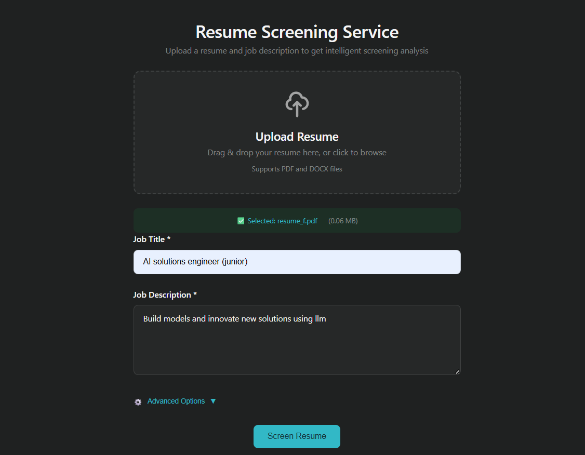
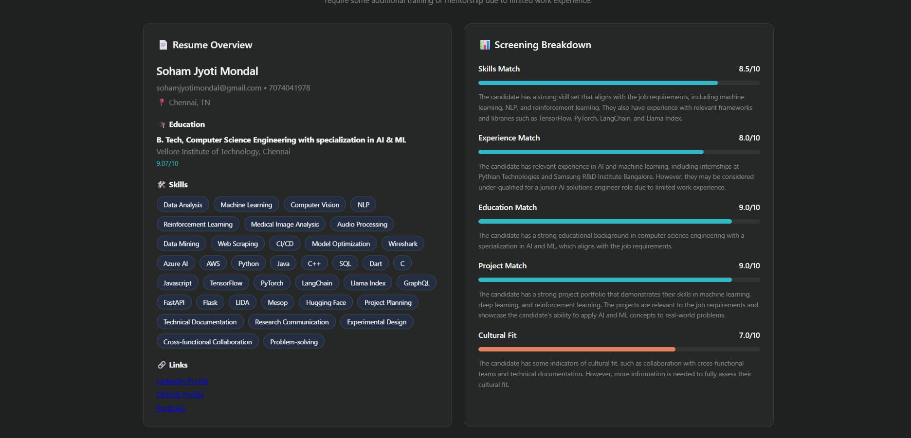
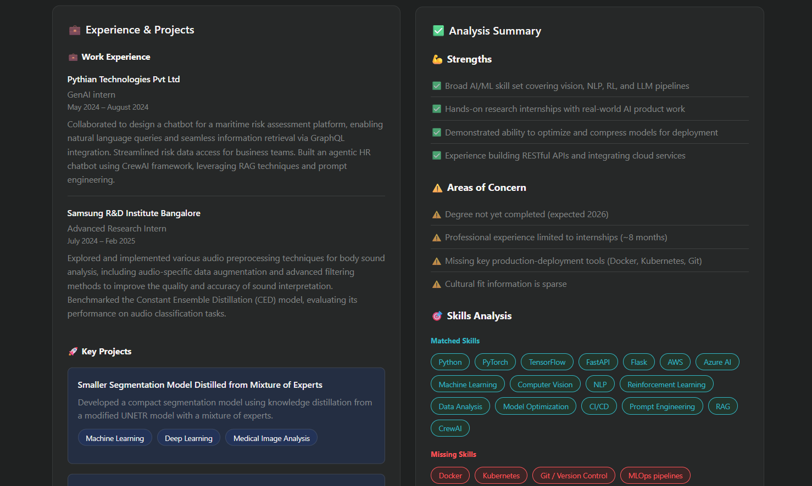

# Resume Screener

A smart resume screening tool that actually reads resumes like a human would. Upload a resume, paste a job description, and get a detailed match score with real insights.






## What it does

Takes the boring out of resume screening. The AI reads through resumes, pulls out what matters, and tells you if someone's a good fit for your job opening.

## Features

- **Catches hidden skills** – Finds relevant skills mentioned in project descriptions that candidates forgot to list in their skills section

- **Structured data extraction** – Uses Instructor to parse resumes into clean, organized data instead of messy text dumps

- **Remove catch phrases** – Remove corporate jargon used to nump up resume scrore

- **Detailed scoring** – Get scores for skills match, experience level, education fit, projects, certifications, and even cultural fit

- **Custom weights** – Adjust what matters most to you. Need someone with tons of experience? Bump up that weight. Looking for fresh ideas? Focus on projects

- **Lightning fast** – Powered by Groq for inference that doesn't make you wait

- **Flexible fields** – All fields are optional. Got a resume without a portfolio? No problem. Missing education? We'll work with what we have

- **Smart caching** – Same resume uploaded twice? We remember it. Only re-screens if the job description changes. Saves time and API costs

## How to use

### Backend setup

```bash
cd backend
pip install -r requirements.txt
```

Create a `.env` file with your API keys:
```
GROQ_API_KEY=your_groq_key_here
SUPABASE_URL=your_supabase_url
SUPABASE_KEY=your_supabase_key
```

**Optional: Set up caching** (recommended!)
- See [backend/SUPABASE_SETUP.md](backend/SUPABASE_SETUP.md) for Supabase cache setup
- Without caching, the app still works but will be slower and more expensive

Run the server:
```bash
python app.py
```

### Frontend

Just open `frontend/index.html` in a browser. That's it.

## API endpoints

**POST /api/parse** – Just parse a resume, no screening
- Upload a PDF or DOCX file
- Get back structured data (name, email, skills, work history, etc.)

**POST /api/screen** – Full screening against a job description
- Upload resume + job title + job description
- Get detailed match analysis with scores and recommendations

## Tech stack

- **Groq** – Fast LLM inference
- **Instructor** – Structured LLM outputs with Pydantic
- **Flask** – Simple API server
- **Python-docx** – Word doc parsing
- Vanilla HTML/CSS/JS for the frontend

## Example outputs

Want to see what the actual output looks like? Check these out:

- **[Parsed resume example](backend/parsed_resume.json)** – See how the parser extracts structured data from a resume
- **[Screening result example](backend/screening_result.json)** – Full screening analysis with scores and recommendations

### Quick sample

```json
{
  "overall_score": 7.83,
  "recommendation": "Potential Match",
  "skill_match": {
    "score": 8.5,
    "matched_skills": ["Python", "Java", "JavaScript", "CI/CD"],
    "missing_skills": ["Direct experience with AWS, GCP, or Azure"],
    "additional_skills": ["Machine Learning", "NLP", "Computer Vision"]
  },
  "strengths": ["Strong technical skills", "Impressive project portfolio"],
  "concerns": ["Limited experience in software development"]
}
```

## File support

- PDF files (.pdf)
- Microsoft Word (.docx, .doc)

## License

Do whatever you want with it.
